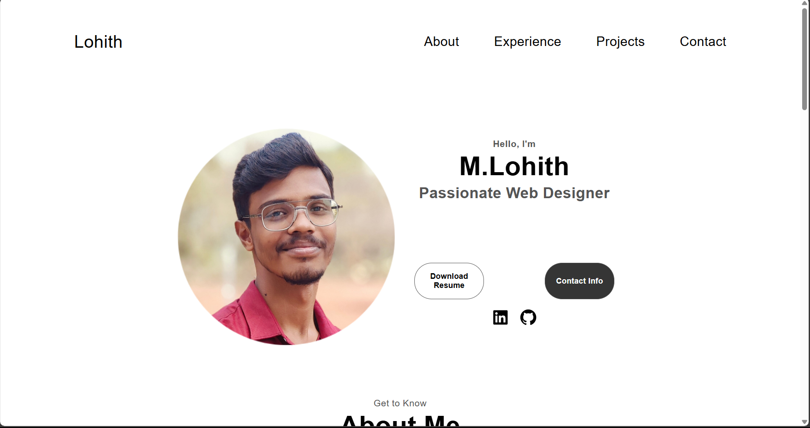
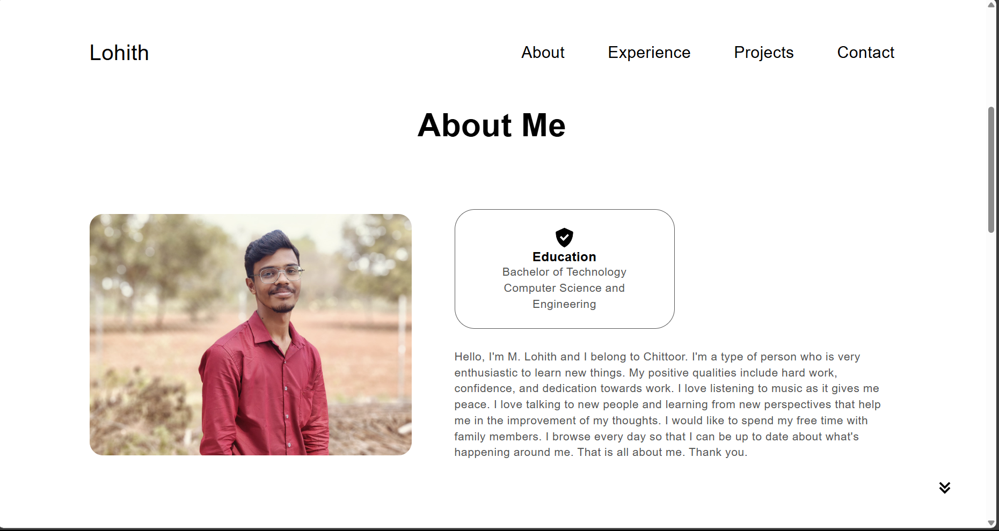
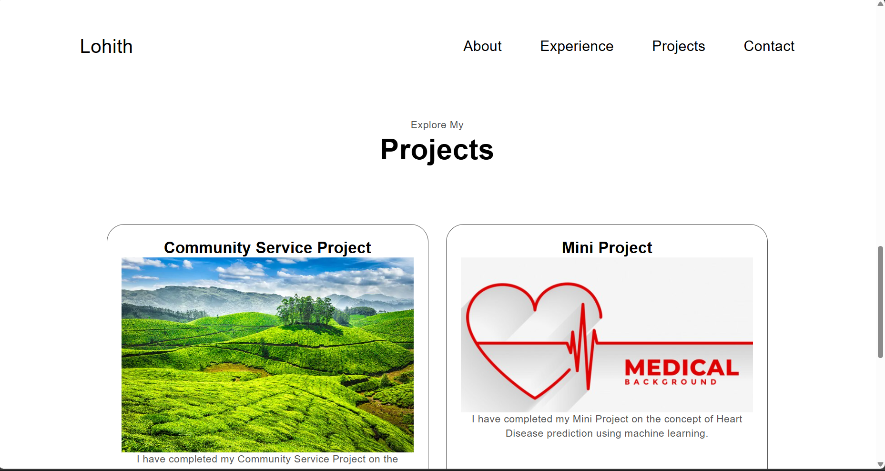
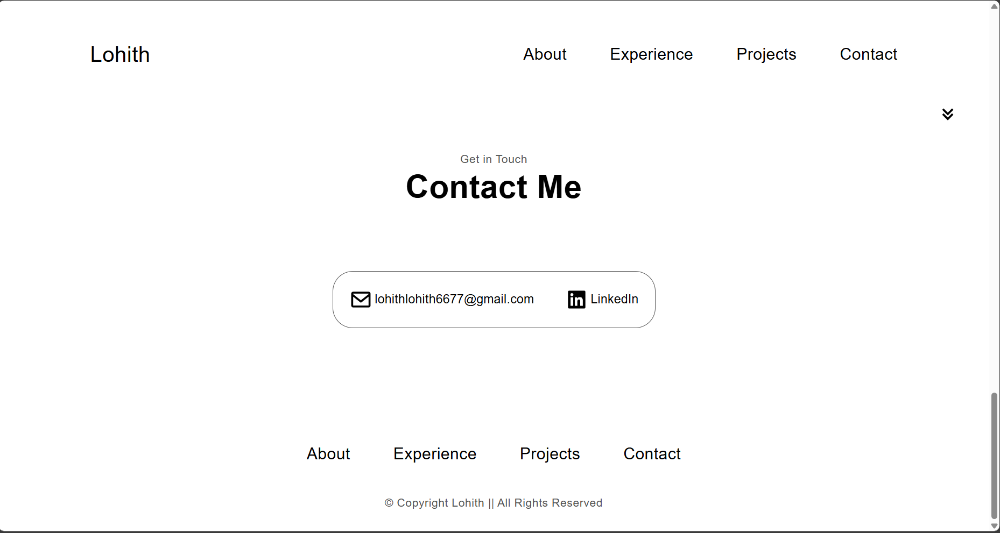

# CodSoft-levle1-task1-portfolio
This repository contain protfolio . The task given by CodSoft 
# Portfolio Website

This repository contains the source code for my personal portfolio website, built using HTML and CSS. The website showcases my skills, projects, and experience as a passionate web designer.

## Table of Contents

- [Portfolio Website](#portfolio-website)
  - [Sections](#sections)
  - [Features](#features)
  - [Getting Started](#getting-started)
  - [Usage](#usage)
  - [Contributing](#contributing)
  - [Contact](#contact)

## Sections
### Projects Section

The portfolio website consists of the following sections:

1. **Home**: Introduction with a profile picture, name, and brief description.
2. **About**: Information about me, including my education and personal interests.
3. **Experience**: My skills and competencies in various technologies.
4. **Projects**: Details of the projects I have completed.
5. **Contact**: Ways to get in touch with me, including email and LinkedIn.

## Features

- **Theme**: The design is clean and uses a bright theme for better visual appeal.
- **Smooth Scrolling**: Navigation between sections is smooth and intuitive.
- **Download Resume**: Option to download my resume directly from the website.
- **Social Links**: Quick access to my LinkedIn and GitHub profiles.

## Getting Started

To get a local copy up and running, follow these steps:

1. **Open `index.html` in your browser** to view the website.

## Usage

You can use this code as a template for your own portfolio website. Customize the content in the HTML files and modify the CSS to fit your personal style.

## Contributing

If you have suggestions for improvements or find any bugs, please open an issue or submit a pull request. Contributions are welcome!

## Contact

If you have any questions or want to get in touch, feel free to contact me at lohithlohith6677@gmail.com.

---

Thank you for visiting my portfolio website repository!
